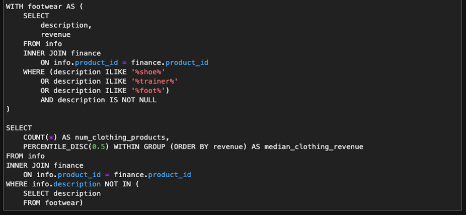

# DataCamp Certified Data Analyst Associate in SQL

#### -- Project Status: [Completed]

## Objective
This repository is dedicated to showcasing my journey through the Data Analyst in SQL career track on DataCamp, which I have successfully completed. It includes a series of exercises that were instrumental in assessing my readiness for the Data Analyst Associate timed exams and the practical exam.

As of November 2023, I have passed all the exams and currently hold the Certified Data Analyst Associate credential.

### Data Analyst in SQL
* [Data Analyst in SQL career track](https://www.datacamp.com/tracks/data-analyst-in-sql)
  * Create and query relational databases using SQL
  * Join tables, apply filters and sub-queries
  * Group and aggregate data for summary statistics
  * PostgreSQL summary stats and window functions
  * Exploratory data analysis and data-driven decision making
  * Effectively comumnicate insights and actionable insights with data visualization

### Data Analyst Associate Certification
* [Data Analyst Associate Certification](https://support.datacamp.com/hc/en-us/articles/7926305856919-Data-Analyst-Associate)
  * Data management
  * Exploratory analysis
  * Statistical experimentation
  * Communication and visualization

### Data and sources
* The data used belongs to [DataCamp](https://www.datacamp.com/)
* Every exercise folder has its own dataset included
